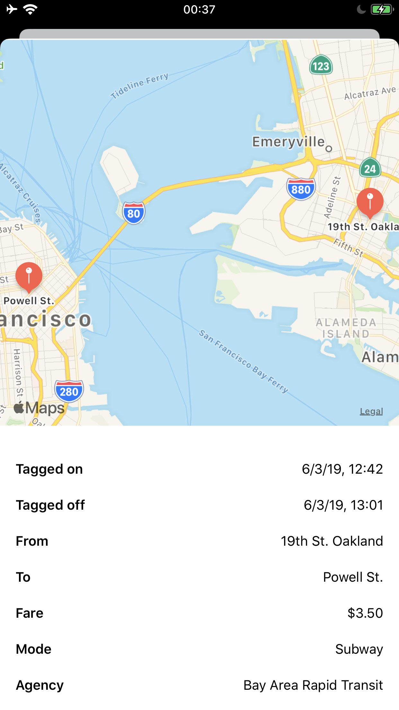

# ABANDONED

Metrodroid, which TransitPal was heavily inspired by, [now has its own fully functional iOS app](https://www.metrodroid.org/metrodroid/ios)! It should be in the App Store "soon". I strongly suggest using that instead of TransitPal. It was fun while it lasted!

# TransitPal
A open source Swift app for iOS that allows you to check your NFC transit card information. Uses [Core NFC](https://developer.apple.com/documentation/corenfc/) and [SwiftUI](https://developer.apple.com/xcode/swiftui/).

Currently it only supports Clipper Card. More cards can be somewhat easily added, although support for any protocol other than MIFARE DESFire would need to be added first.

Database of stations is [provided by Metrodroid](https://github.com/micolous/metrodroid/tree/master/extra/mdst/#readme).

## Requirements
- Xcode 11
- iOS 13

## Screenshots

 

## LICENSE

Apache-2.0
